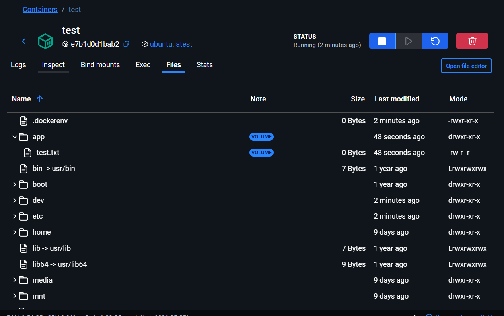
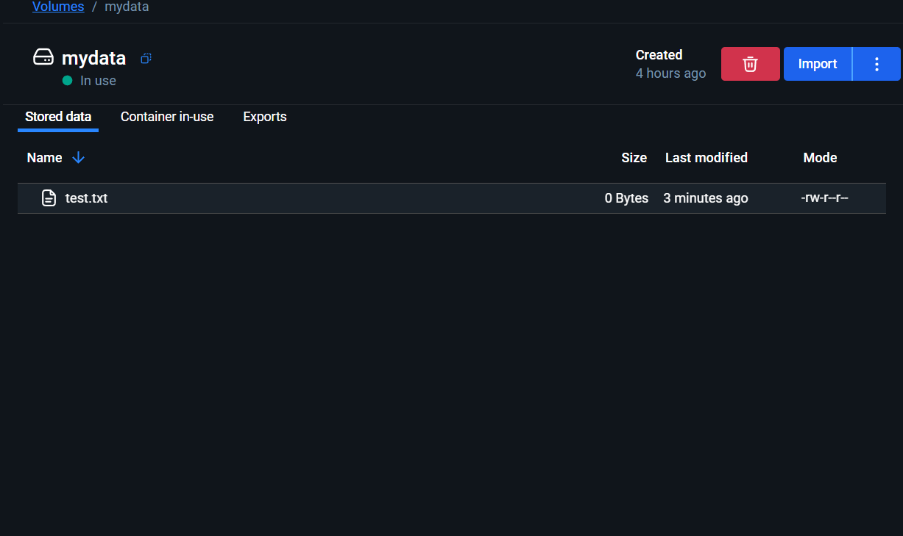
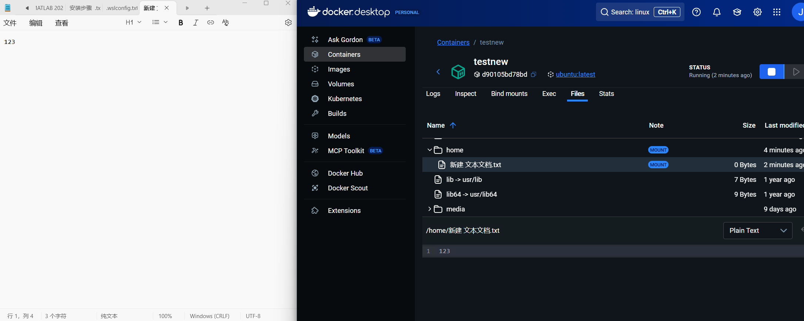
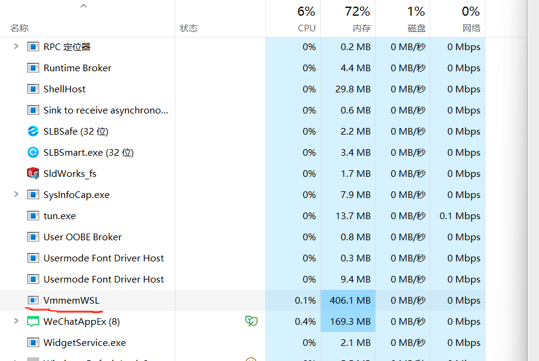
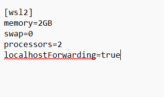

# Linux-learning
A document of some thing about Linux ,especially ubuntu.
# 什么是docker
Docker 是一种开源的 容器化 技术，它允许开发者将应用程序及其所有依赖项（包括代码、库、配置文件等）打包在一个“容器”中，以便在任何环境中都能一致地运行。**容器类似于虚拟机，但它们更加轻量级和高效，因为容器共享宿主操作系统的内核，而虚拟机则需要各自的操作系统** 

## docker主要作用
    1.简化应用的部署和管理
    2.提高开发效率（可将本地环境测试后直接移植到生产环境中）
    3.资源隔离和环境隔离（每个docker容器之间相互隔离）
    4.具有开平台一致性

## docker原理
### 容器概念
    容器是一个轻量级的、可执行的独立软件包，它封装了运行应用程序所需的所有内容（如代码、库、依赖、配置等）。每个容器共享宿主机的操作系统内核，但它们在逻辑上是相互隔离的。
### 镜像概念
    镜像是容器的“蓝图”或模板，它包含了构建容器所需的一切内容（如文件系统、依赖项等）。镜像是静态的，而容器是运行时的实例。开发者可以基于镜像创建多个容器。
### 容器镜像之间关系
    类似Java中类与实例的关系；镜像是静态的、只读的，容器是镜像的可运行实例。
 docker就是在docker hub仓库存储镜像，用户可以从这下载镜像，使用时通过docker引擎可以创建具有不同设定参数的实例。
 
### 容器相比于虚拟机更加轻量化的解释（为什么docker性能优于传统虚拟机软件）
    容器直接在宿主操作系统的内核上运行。它们 共享宿主机的操作系统内核，而不需要每个容器都有自己独立的操作系统。每个容器只包含应用和其依赖的库、文件系统等。因此，容器比虚拟机要轻量得多，因为它们不需要为每个实例都启动一个完整的操作系统。
    容器只是隔离化的进程，它们共享宿主操作系统的内核资源，这意味着容器只需要存储应用程序和其所需的环境，而不需要为每个容器都维护一个完整的操作系统。
***
# 使用docker配置linux开发环境
## step1
    windows系统需要开启Hyper-v功能
    控制面板->启用或关闭windows功能->开启Hyper -v
    如果在以上步骤中没有找到Hyper -v功能，可能你的系统是windows家庭版（不具备该功能），通过以下步骤进行配置：
    1.打开PowerShell
    2.输入
        wsl --install
    进行wsl的安装
    3.输入
        wsl --set-default-version 2
    配置wsl的版本为wsl2
    4.使用
        wsl --list --verbose
    确认你的wsl已安装并且正在使用。
## step2
    下载docker：官网链接：https://www.docker.com/
    windows系列台式机和笔记本一般选择Windows ADM 64
    安装完成后使用
        docker --version
    输出版本信息，说明你的docker已成功安装
## step3
    打开docker的docker hub搜索Ubuntu，选择你喜欢的镜像环境进行下载，有的可能已经在内部配置好了python或者其他的编程环境。
    下载完之后可以在终端使用docker images或者docker image ls命令进行验证。

## step4 
    使用下载的镜像创建一个容器。
    在终端中执行：
        docker -it --rm ubuntu:latest /bin/bash 
        -it指的是以交互的形式使用这个镜像；
        --rm容器退出以后自动删除这个容器；（删除掉后创建的容器不会自动删除）
        ：以前指的是镜像名（ubuntu），：以后指的是版本
        /bin/bash的作用是启动ubuntu后自动打开这个容器的命令行
    创建成功后，可以新建一个终端，使用
        docker ps
        命令查看正在运行的容器
        docker ps -all
        命令可以查看当下所有容器
    exit命令用于退出容器
    docker rm 容器id，可以删除不在运行的容器。
完成以上操作就完成了Linux环境的基本搭建，想要加入编程环境的话可以进一步配置，或者在docker hub上下载已经配置好的带有编程环境的镜像。
***

# 数据挂载
## 数据卷
    在 Docker 中，数据卷（Volumes）是用来持久化和管理容器数据的机制。默认情况下，容器的数据是存储在容器内部的，如果容器被删除，这些数据也会丢失。因此，为了持久化数据和共享数据，Docker 提供了数据卷。
    主要作用和特点包括：
    1.数据持久化：
    数据卷使得容器可以拥有持久化的存储，不受容器生命周期的限制。即使容器被删除，数据仍然存在，可以在新的容器中重新挂载。
    2.容器之间的数据共享：
    数据卷可以被多个容器共享。多个容器可以挂载同一个数据卷，从而实现数据的共享和交换。
    3.容器与宿主机的数据共享：
    数据卷可以挂载到宿主机的文件系统中，容器和宿主机之间的数据交换变得简单。数据卷可以帮助容器和宿主机之间实现有效的数据传递。
    4.性能优化：
    数据卷的读写性能比容器内部的文件系统要高，因为数据卷是独立于容器的存储方式，通常会存储在宿主机的某个位置，并且对容器来说是透明的。
    5.备份和恢复：
    你可以方便地备份和恢复数据卷中的数据。例如，通过复制数据卷的内容或者使用 Docker 的相关工具进行备份。
    
## 创建数据卷
    创建数据卷
        docker volume create mydata 
    创建一个名为mydata的数据卷
        docker volume ls
    查看数据卷
## 链接数据卷和容器
    输入一下指令
        docker run -it -v mydata:/app --name test ubuntu
    创建一个绑定数据卷的容器test；
    切换到app文件夹下,创建一个txt文件：
        cd \app
        touch test.txt
    此时打开docker主面板，选择Container，打开你正在使用的容器test，点击file，可以看到如图的效果：

    打开Volume选项，打开数据卷mydata，里面同样存放了一个test.txt文件：
 
    当然也可以将其他的文件夹与数据卷绑定，被绑定的数据卷主要用于存放需要保留的信息（不建议挂载到根目录）。

    -v参数的另一种使用方法例如：-v F:/guazai:/home
    将主机上的F:/guazai文件夹挂载到容器上的home文件夹下；此时容器内/home文件夹下的数据会存放到主机的F:/guazai文件夹下。这里输入：
        docker run -v F:/guazai:/home -it --name testnew ubuntu
    此时可以在主机内通过对F:/guazai文件夹操作实现对容器内的/home文件进行操作，其内容是同步的。
 

# 镜像的构建与镜像的上传
## 方法一
    使用docker commit，输入
         docker commit 容器id 镜像名称：镜像版本
    完成构建镜像
        docker rmi 镜像id
        删除镜像
## 方法二
    创建一个用于构建镜像的Dockerfile
    Dockerfile常用指令总结到pdf了，也可以上网查询。

# 进阶用法docker compose
    允许开发者通过一个单独的YAML配置文件（通常命名为 docker-compose.yml）来配置应用所需的所有服务，然后使用一条命令即可创建并启动所有服务。
    主要用于对于多个容器的统一管理，和统一配置环境。
    使用YAML文件语法进行配置；
    主要用到的4条docker指令：
    启动所有服务：docker compose up
    停止并删除所有服务：docker compose down
    查看服务状态：docker compose ps
    重启服务：docker compose restart

# 其余配置修改
    修改1：完成以上wsl2的下载和配置后，打开任务管理器会发现一个名为VmmemWSL的后台程序，占用很大的运存（可能有几GB），为了不让他占用过多的运存，做一下修改：

    打开文件资源管理器，输入：
        %UserProfile%
        该文件下会有一个.wslconfig的文本文件，打开该文本文件，将memory设置为2GB，或者更小；如果没有就新建一个配置可参考下图：
        

参考视频来自Youtube，感谢以下各位博主的分享！

[参考视频1](https://www.youtube.com/watch?v=Ozb9mZg7MVM)
[参考视频2](https://www.youtube.com/watch?v=8hNSP_nbPy0)
[参考视频3](https://www.youtube.com/watch?v=zqRVrj64QmA)

常用命令来源公众号GeekHour，回复Linux即可下载！
